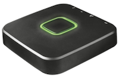
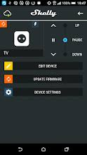

<!-- .slide: data-menu-title="Domotica - GroSkills #5" data-background-image="images/groskills.jpg" data-background-opacity="0.3" -->
# Domotica

note:
GroSkills 5th edition, 6 februari 2020
&#x1F93D;&#x200D;&#x2642;&#xFE0F;

- Visualisatie
- DeConz [Compatibility list](https://zigbee.blakadder.com/deconz.html)

---

<!-- .slide: data-menu-title="Wat is Domotica" data-background-image="images/brain.png" data-background-opacity="0.2" -->
## Wat is Domotica of Home Automation

- Wat kun je ermee?

- Hoe begin je met het 'slimmer' maken van je huis.

---

<!-- .slide: data-menu-title="Domotica = Domus + Robotica" -->
## Domotica ?

<!-- .element height="90%" width="90%" -->

--

## Smart vs Automated

<!-- .slide: data-menu-title="Smart vs Automated Home" -->

<!-- .element height="90%" width="90%" -->

---

<!-- .slide: data-menu-title="Definitions" data-background-image="images/wikipedia.png" data-background-opacity="0.1" -->
## Definities

> Het toepassen van elektronica en huisnetwerken ten behoeve van de automatisering van processen in en om een woning. <!-- .element: class="fragment" data-fragment-index="1" -->

> De integratie van technologie en diensten, ten behoeve van een betere kwaliteit van wonen en leven.<!-- .element: class="fragment" data-fragment-index="2" -->

note: Bronnen Wikipedia en Stichting Smart Homes

--

<!-- .slide: data-menu-title="Modern Times - Automated Eating" data-background-image="images/modern-times-automated-eating.gif" data-background-opacity="0.9" -->

note: Modern Times (1936), [Giphy](https://media.giphy.com/media/o2NnUFBsrOMog/giphy.gif)

---

<!-- .slide: data-menu-title="Praktijkvoorbeelden" -->
## Praktijk voorbeelden

- Initieel voor personen met een "functiebeperking"

---

<!-- .slide: data-menu-title="Waarom niet" -->
## Waarom niet?

- Ingewikkeld
- Techniek is niet volwassen (geen standaardisatie)
- Het is duur
- Niet veilig
- Je wordt er lui van
- Je wordt er afhankelijk van
- Het kost te veel tijd

--

<!-- .slide: data-menu-title="Security" -->
## Security

- Waar gaat jouw data naar toe?
- Wat kun je met die data
- Werkt dit
- Lijkt beter ;-)

---

<!-- .slide: data-menu-title="Waarom wel" -->
## Waarom wel?

- Gebruiksgemak <!-- .element: class="fragment" data-fragment-index="1" -->
- Wooncomfort <!-- .element: class="fragment" data-fragment-index="2" -->
- Veiligheid <!-- .element: class="fragment" data-fragment-index="3" -->
- Efficient energie gebruik <!-- .element: class="fragment" data-fragment-index="4" -->
- Leuk <!-- .element: class="fragment" data-fragment-index="5" -->
- Leerzaam <!-- .element: class="fragment" data-fragment-index="6" -->

note:

- Gebruiksgemak (Licht automatisch uit/aan)
- Wooncomfort (Verwarming automatisch uit/aan)
- Veiligheid (Inbraakpreventie)
- Efficient energie gebruik (Tado/Nest)

---

<!-- .slide: data-menu-title="Wat wil je automatiseren" data-background-image="images/modern-times-work.gif" data-background-opacity="0.3"-->
## Wat wil je automatiseren?

--

<!-- .slide: data-menu-title="Voorbeelden" data-background-image="images/chip_bg.jpg" data-background-opacity="0.1"-->
## Voorbeelden

--

<!-- .slide: data-menu-title="Mijn praktijk voorbeelden" -->
## Mijn praktijk voorbeelden

- Verwarming uit en aan o.b.v. aanwezigheid
- Verlichtings scenes
- Kerstverlichting uit en aan met timer
- Bewegingsdetectie en notificatie
- Licht automatisch aan bij thuiskomst van de eerste persoon na zonsondergang
- Slimme meter uitlezen
- Opbrengst Zonnepanelen (Fronius)
- Temperatuur, vochtigheid en luchtdruk metingen
- etc.

---

<!-- .slide: data-menu-title="Hoe werkt het" -->
## Hoe werkt het?

<!-- .element heigth="80%" width="80%" align="center" -->

note:
omgeving => sensor => processor => actuator => omgeving

sensor = apparaat dat informatie uit de omgeving kan waarnemen (zintuig)
actuator = toestel dat invloed kan uitoefenen op de (actuator) omgeving
controller = verwerk sensor gegevens en stuur actuator aan (processor, regelaar, computer)

--

<!-- .slide: data-menu-title="Signalen - Protocollen" data-background-image="images/tin-can-telephone.jpg" data-background-opacity="0.2"-->
## Signalen - Protocollen

- WiFi, 2,4 GHz
- Zigbee
- 6LoWPAN
- Zwave
- RF, X10 afgeleide
- X10
- CHIP, Connected Home over IP(v6)
  - protocol in ontwikkeling
- MQTT, pub-sub messaging

--

<!-- .slide: data-menu-title="Project CHIP" -->
## Project CHIP

--

<!-- .slide: data-menu-title="MQTT" -->

> MQTT is a machine-to-machine (M2M)/IoT connectivity protocol. It was designed as an extremely lightweight publish/subscribe messaging transport.

---

<!-- .slide: data-menu-title="Wat is er op de markt?" -->
## Wat is er op de markt?

en wat kun je zelf?

note:

Overgeleverd aan een leverancier of zelf in controle?

--

|              |                 Zigbee                 |              WiFi               |
| :----------- | :------------------------------------: | :-----------------------------: |
| Manufacturer | Philps Hue, Ikea TR&Aring;DFRI, Xiaomi | Sonoff, Shelly, Tuya, Espressif |
| Controller   |           on premise, cloud            |        app, cloud based         |
| Modification |      DeConz, Zigbee2MQTT, Tasmota      |        Tasmota, ESPHome         |

---

<!-- .slide: data-menu-title="KlikAanKlikUit set" -->
## KlikAanKlikUit set

--

<!-- .slide: data-menu-title="KlikAanKlikUit set" -->
## KlikAanKlikUit

|                                                |                                              |                                                  |                                  |
| :--------------------------------------------: | :------------------------------------------: | :----------------------------------------------: | :------------------------------: |
|  |  |  |  |
|                    **Lamp**                    |                **Bediening**                 |               **Control Station**                |             **App**              |

note:

Multiprotocol gateway:

- Aansturing Hue gateway via Zigbee
- Default RF-protocol
  - 433 MHz, 868 Mhz

--

<!-- .slide: data-menu-title="KlikAanKlikUit characteristics" data-background-image="images/kaku_bg.png" data-background-opacity="0.1"-->
## KlikAanKlikUit kenmerken

- Protocol: RF (433 en 868 MHz)
- Groeiend assortiment
- Integratie met Philips Hue via gateway
- Geen API's, gesloten eco-systeem
- RF technologie, "fire-and-forget"

--

<!-- .slide: data-menu-title="KlikAanKlikUit integrations" data-background-image="images/diy_rf-link_gateway.png" data-background-opacity="0.2"-->
## KlikAanKlikUit integratie met RFLink

- [How to connect Home Assistant & KlikaanKlikuit](https://medium.com/@renesijnke/how-to-connect-home-assistant-klikaanklikuit-kaku-492f8e7fdf4a)
- [RFLink Gateway](http://www.rflink.nl/blog2/)

---

<!-- .slide: data-menu-title="Philips Hue" -->
## Philips Hue

|                                  |                                      |                                |
| :------------------------------: | :----------------------------------: | :----------------------------: |
|  |  |  |
|             **Lamp**             |              **Bridge**              |            **App**             |

--

<!-- .slide: data-menu-title="Philips Hue characteristics" data-background-image="images/philips-hue-logo.png" data-background-opacity="0.2"-->
## Philips Hue kenmerken

- Protocol: Zigbee
- Integraties met HomeKit, Alexa en Google Assistant
- Groeiend "exclusief" assortiment
- Eigen gateway
- Alternatieve Zigbee gateways mogelijk
  - Deconz of Zigbee2MQTT

--

<!-- .slide: data-menu-title="Philips Hue" data-background-image="images/philips-hue-logo.png" data-background-opacity="0.2"-->
## Philips Hue LivingColors

- [2.4 Ghz device in RFLink device list](http://www.rflink.nl/blog2/devlist)
- [LivingColors 1st generation](http://www.knutsel.org/2009/01/01/livingcolors-1st-generation/)

---

<!-- .slide: data-menu-title="Ikea TR&#x00C5;DFRI" -->
## Ikea TR&Aring;DFRI

|                                    |                                          |                                  |
| :--------------------------------: | :--------------------------------------: | :------------------------------: |
|  |  |  |
|              **Lamp**              |               **Gateway**                |             **App**              |

note: å = &#x00E5;, Å = &#x00C5;

--

<!-- .slide: data-menu-title="Ikea characteristics" data-background-image="images/Ikea-logo-bg.png" data-background-opacity="0.1"-->
## Ikea kenmerken

- Protocol: Zigbee
- Integraties met HomeKit, Alexa en Google Assistant
- Groeiend "betaalbaar" assortiment
- Eigen gateweay
- Alternatieve Zigbee gateways mogelijk
  - Deconz of Zigbee2MQTT

---

<!-- .slide: data-menu-title="Xiaomi" -->
## Xiaomi

|                                             |                                             |                                      |
| :-----------------------------------------: | :-----------------------------------------: | :----------------------------------: |
|  |  |  |
|                 **Sensors**                 |                 **Gateway**                 |               **App**                |

--

<!-- .slide: data-menu-title="Xiaomi characteristics" data-background-image="images/xiaomi_logo_bg.png" data-background-opacity="0.1" -->
## Xiaomi kenmerken

- Protocol: Zigbee
- Standaard Chinese Cloud
- Grote Chinese speler
- Sensoren, Switches, IP Camera, Doorbell
- Alternatieve Zigbee gateways mogelijk
  - Deconz of Zigbee2MQTT

---

<!-- .slide: data-menu-title="Tado&deg;" -->
## Tado&deg;

|                                                       |                                                             |                                               |                                       |
| :---------------------------------------------------: | :---------------------------------------------------------: | :-------------------------------------------: | :-----------------------------------: |
|  |  |  |  |
|                    **Thermostaat**                    |                          **Kraan**                          |                  **Gateway**                  |                **App**                |

--

<!-- .slide: data-menu-title="Tado&deg; characteristics" data-background-image="images/tado_logo_bg.png" data-background-opacity="0.2"-->
## Tado&deg; kenmerken

- Protocol: 6LoWPAN (868 MHz, IPv6)
- Germany based company
- Amazon Cloud
- "Smart Heating"
- Focus op efficiente verwarming
- Warmte "zones" (eigen thermostaatkranen)
- Integraties met HomeKit, Alexa en Google Assistant

---

<!-- .slide: data-menu-title="Sonoff" -->
## Sonoff

|                                            |                                        |                                      |
| :----------------------------------------: | :------------------------------------: | :----------------------------------: |
|  |  |  |
|               **Schakelaar**               |                **Lamp**                |               **App**                |

note:

Smart ON/OFF
[iTead.cc](https://itead.cc/smart-home.html)
Flashen met Tasmota

--

<!-- .slide: data-menu-title="Sonoff characteristics" data-background-image="images/sonoff_logo.png" data-background-opacity="0.1" -->
## Sonoff kenmerken

- Protocol: WiFi
- Standaard Chinese Cloud
- Switches met en zonder verbruiks gegevens, lampen, wandschakelaars
- Firmware aanpasbaar (Tasmota)

--

<!-- .slide: data-menu-title="Sonoff fail" -->

## Sonoff fail

---

<!-- .slide: data-menu-title="Shelly"  -->
## Shelly

|                                             |                                        |                                      |
| :-----------------------------------------: | :------------------------------------: | :----------------------------------: |
|  |  |  |
|                 **Switch**                  |                **Lamp**                |               **App**                |

note:

[shelly.cloud](https://shelly.cloud)

--

<!-- .slide: data-menu-title="Shelly characteristics" data-background-image="images/shelly_logo_bg.png" data-background-opacity="0.1" -->
## Shelly kenmerken

- Protocol: WiFi
- Shelly Cloud optional
- Groeiend assortiment
- Kleine inbouw WiFi schakelaars
- Firmware aanpasbaar(Tasmota)
- MQTT-support, out of the box

---

<!-- .slide: data-menu-title="LSC (Tuya)" data-background-image="images/action_logo.png" data-background-opacity="0.2" -->
## LSC (Tuya)

|                                  |                                  |                                |
| :------------------------------: | :------------------------------: | :----------------------------: |
|  |  |  |
|           **Stekker**            |             **Lamp**             |            **App**             |

--

<!-- .slide: data-menu-title="LSC (Tuya) characterisatics" data-background-image="images/action_logo.png" data-background-opacity="0.2" -->
## LSC (Tuya) kenmerken

- Protocol: WiFi
- Verkoop bij Action
- Voordelig
- Firmware aanpasbaar (Tasmota)
  - Let op: niet alle devices zijn te flashen

--

<!-- .slide: data-menu-title="LSC (Tuya) firmware" data-background-image="images/action_logo.png" data-background-opacity="0.2" -->
## LSC (Tuya) firmware

<!-- .element height="90%" width="90%" -->

[Tuya-Convert](https://www.heise.de/ct/artikel/Tuya-Convert-Escaping-the-IoT-Cloud-no-solder-needed-4284830.html)

[Tasmota templates](https://templates.blakadder.com)

---

<!-- .slide: data-menu-title="Works with ... (voice)" -->
## Works with ... (voice)

--

<!-- .slide: data-menu-title="Works with Alexa" data-background-image="images/amazon_echo.png" data-background-opacity="0.4" -->
## Works with Amazon

<!-- .element height="90%" width="90%" -->

--

<!-- .slide: data-menu-title="Google Assistant" data-background-image="images/google_smart_speaker.png" data-background-opacity="0.4"-->
## Works with Google

<!-- .element height="90%" width="90%" -->

--

<!-- .slide: data-menu-title="Apple Homekit" data-background-image="images/siri.png" data-background-opacity="0.2" -->
## Works with Apple

<!-- .element height="50%" width="50%" -->

note:
Siri
Homekit
AppleTV
iPhone
Hue

GitHub OpenSource

---

<!-- .slide: data-menu-title="Opties" -->
## Opties: controle vs gemak

- WiFi: leveranciers firmware of eigen?
- Zigbee: leveranciers gateway of eigen?
- DIY / Zelfbouw

note:

Wat zijn de mogelijkheden?

--

|              |              WiFi               |                 Zigbee                 |
| :----------- | :-----------------------------: | :------------------------------------: |
| Manufacturer | Sonoff, Shelly, Tuya, Espressif | Philps Hue, Ikea TR&Aring;DFRI, Xiaomi |
| Controller   |        app, cloud based         |           on premise, cloud            |
| Modification |        Tasmota, ESPHome         |      DeConz, Zigbee2MQTT, Tasmota      |

---

<!-- .slide: data-menu-title="WiFi firmware" -->
## WiFi firmware vervangen

Twee opties:

- Fysiek
- OTA

--

<!-- .slide: data-menu-title="Tasmota" -->
## Tasmota

<!-- .element height="50%" width="50%" -->

[Tasmota](https://tasmota.github.io/docs/#/)

[Tasmota template list](https://templates.blakadder.com/index.html)

note: Theo Arends

--

<!-- .slide: data-menu-title="ESPHome" -->
## ESPHome

[ESPHome](https://esphome.io/)

---

<!-- .slide: data-menu-title="Zigbee gateway vervangen" -->
## Zigbee gateway vervangen

Twee opties:

- Gateway kant en klaar kopen
- Gateway onderdelen kopen

--

<!-- .slide: data-menu-title="DeconZ" -->
## DeconZ

--

<!-- .slide: data-menu-title="Zigbee2MQTT" -->
## Zigbee2MQTT

--

<!-- .slide: data-menu-title="Tasmota Zigbee" -->
## Tasmota Zigbee

Nieuwe optie bij Tasmota

---

<!-- .slide: data-menu-title="DIY Building Blocks" -->
## DIY Bouwblokken

--

<!-- .slide: data-menu-title="Espressif" -->
## Espressif based Wemos: ESP8266 of ESP32

Espressif Wemos
[Ali Express]

---

<!-- .slide: data-menu-title="Domoticz" -->
## "The one to rule them all ..."

<!-- .element height="50%" width="50%" -->

--

<!-- .slide: data-menu-title="Domoticz" -->
## Domoticz

<!-- .element height="30%" width="30%" align="left" -->

- [domoticz.com](https://www.domoticz.com)
- OpenSource
- Loopt een beetje achter
- Extra functies door plugins
- Community wordt kleiner

--

<!-- .slide: data-menu-title="openHAB" -->
## openHAB

<!-- .element height="30%" width="30%" align="left" -->

- [openhab.org](https://www.openhab.org)
- OpenSource
- Robuust
- Sterke (Duitse) community
- Ontwikkelingen gaan langzaam
- Minder flexibel

--

<!-- .slide: data-menu-title="Home Assistant"  -->
## Home Assistant

<!-- .element height="30%" width="30%" align="left" -->
- [home-assistant.io](https://www.home-assistant.io)
- OpenSource
- "New cool kid"
- Snelst groeiende community
- Eenvoud is het motto
- Extra functies door plugins
- Snelle ontwikkelingen

note:
[Home Assistan.io](https://www.home-assistant.io)

---

<!-- .slide: data-menu-title="Home Assistant in depth" data-background-image="images/home-assistant-bg.png" data-background-opacity="0.4" -->
## Home Assistant in depth

<!-- .element height="50%" width="50%" -->

--

<!-- .slide: data-menu-title="HA-Installatie" data-background-image="images/home-assistant-bg.png" data-background-opacity="0.4" -->
## HA-Installatie

- Hassbian (on Raspberry Pi)
- Hass.io (on Raspberry Pi, Intel NUC, VM)
- Hass.io (on Ubuntu / Debian)
- Docker
- Linux/Mac-Python Virtual Environment
- Windows-Python Virtual Environment

[Home Assistant Install Methods Comparison Matrix](https://docs.google.com/document/d/1KJKfaigHbOQylUUAzCc1wUy70FdTGRFE61HXamgAb-Q/edit)

note:

[Home Assistant Install Methods Comparison Matrix](https://docs.google.com/document/d/1KJKfaigHbOQylUUAzCc1wUy70FdTGRFE61HXamgAb-Q/edit)

--

<!-- .slide: data-menu-title="HACS" data-background-image="images/home-assistant-bg.png" data-background-opacity="0.4" -->
## HACS

Home Assistant Community Store

<!-- .element height="40%" width="40%" align="left" -->

[hacs.xyz](https://hacs.xyz)

note:

[HACS](https://hacs.xyz)

--

<!-- .slide: data-menu-title="Home Assistant - Overview" data-background-image="images/home-assistant-bg.png" data-background-opacity="0.4" -->
## Home Assistant - Overview

<!-- .element height="70%" width="70%" -->

--

<!-- .slide: data-menu-title="Home Assistant Demo" data-background-image="images/home-assistant-bg.png" data-background-opacity="0.4" -->
## Home Assistant - Slaapkamer

<!-- .element height="90%" width="90%" -->

--

<!-- .slide: data-menu-title="Home Assistant Demo" data-background-image="images/home-assistant-bg.png" data-background-opacity="0.4" -->
## Home Assistant Demo

---

<!-- .slide: data-menu-title="DIY Projects" -->
## DIY Projecten

--

<!-- .slide: data-menu-title="Smart doorbell" -->
## Slimme Deurbel

<!-- .element height="70%" width="70%" -->

[Smart doorbell for just $2](https://frenck.dev/diy-smart-doorbell-for-just-2-dollar/)

--

<!-- .slide: data-menu-title="Flash Tasmota firmware on lamp" -->
## Flash lamp met Tasmota

<!-- .element height="20%" width="20%" -->

Flash een LSC lamp van de Action met [Tuya - Convert](https://www.heise.de/ct/artikel/Tuya-Convert-Escaping-the-IoT-Cloud-no-solder-needed-4284830.html)

--

<!-- .slide: data-menu-title="Temperature sensor" -->
## Temperatuur sensor

Wemos + sensor + EspHome

note:

Wemos met temperatuur sensor laten zien.

---

<!-- .slide: data-menu-title="Hoe begin je?" data-background-image="images/swimmer-on-starting-block.jpg" data-background-opacity="0.3" -->
## Hoe begin je?

- Doel: wat is het, dat je wil bereiken? <!-- .element: class="fragment" data-fragment-index="1" -->
- Inventarisatie: wat heb je nu? <!-- .element: class="fragment" data-fragment-index="2" -->
- Analyse: wat onbreekt er nog? <!-- .element: class="fragment" data-fragment-index="3" -->
- Planning: maak een plan <!-- .element: class="fragment" data-fragment-index="4" -->
- Actie:<!-- .element: class="fragment" data-fragment-index="5" -->
  - middelen<!-- .element: class="fragment" data-fragment-index="6" -->
  - kennis<!-- .element: class="fragment" data-fragment-index="7" -->
  - aan de slag!<!-- .element: class="fragment" data-fragment-index="8" -->

---

<!-- .slide: data-menu-title="Lessons learned" -->
## Lessons learned

- Begin klein
- Plan je tijd (keer 3)
- Omarm Murphy's law
- Beperk de externe afhankelijkheden
- Zorg voor een fall-back scenario
- Houdt rekening met de "PAF"
- Je kunt meer dan je denkt

note:
PAF = Parter Acceptance Factor

---

<!-- .slide: data-menu-title="That's all folks" data-background-image="images/Thats_all_Folks.jpg" data-background-opacity="1.0" -->
